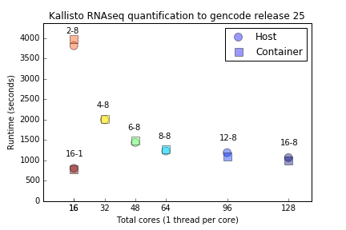
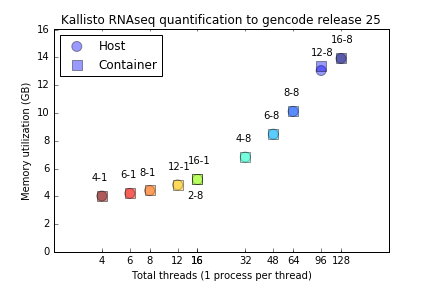
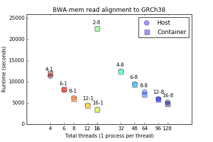
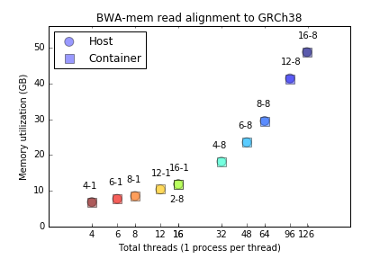
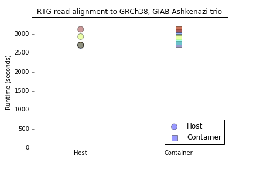
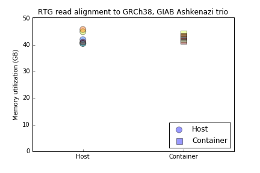
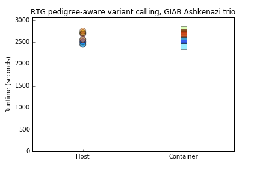
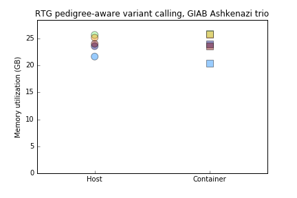

# Singularity: HPC-focused containers for reproducible and archivable computational research on a project-by-project basis

## Cameron J. Prybol1, Gregory M. Kurtzer2, Euan A. Ashley1, 3, 4

### 1Department of Genetics, Stanford University, Stanford, CA, 94305, USA., 2High Performance Computing Services, Lawence Berkeley National Laboratory, Berkeley, CA, 94720, USA., 3Department of Medicine, Stanford University, Stanford, CA, 94305, USA., 4Stanford Center for Inherited Cardiovascular Disease, Stanford University, Stanford, CA, 94305, USA.

## Abstract

Datasets that are too large to analyze on personal computers have become pervasive across the sciences. Many research institutions have invested in high-performance computing (HPC) clusters to accomidate the ever-growing resource demands of researchers. These HPC clusters are often configured in similar ways, and generally utilize a unix-based operating system, a job scheduler to request resources, and access to essential tools such as open-mpi. However, similar is not identical, and the process of preparing a computing enviroment, installing software, and configuring settings and system variables is unique to each cluster, and can even be unique for different users of the same cluster. Without a sufficiently similar computing environment (i.e. same software, version numbers, operating system, environmental variables) it can be prohibitively difficult to replicate analyses, even when given the same input code and datasets. Researchers need tools that allow them to overcome these system-specific differences to ensure reproducility on other clusters, as well as their own clusters as updates are made over time. An ideal solution would be one that works with existing tools, workflows, user-permissions, and does not require extensive learning-overhead. We introduce Singularity, a container-platform designed for modern HPC clusters. Researchers can encapsulate linux-based operating systems with all software and configurations necessary to run analyses into single files, making the computing environments used to produce publications as easy to distribute and archive as the accompanying code and datasets. Singularity containers also overcome security issues that have prevented the widespread adoption of existing container implementations like Docker on shared-HPC systems. All in all, Singularity containers enable researchers to focus on producing results by alleviating system-specific configuration issues, while at the same time promoting transparancy and integrity in research by lowering the barrier for others to replicate and review results.

## Introduction

Researchers need a means for ensuring reliable execution of their analyses. For those who don't often need to leave single frameworks, such researchers who find it sufficient to perform their entire analyses within Excel, R, Python, or other unified frameworks/languages, reproducibility is not usually a problem. However, as soon as workflows scale beyond the size or complexity that can be effectively handled within these frameworks, the tool of choice for decades has been chaining highly-efficient command-line programs written in statically-compiled languages like C and Fortran, as well as just-in-time (JIT) languages like Java together to process a set of inputs step-by-step until the desired output is produced. While command line tools are often unmatched in performance and ease-of-use, they can often be difficult to install and configure. The tools often written by software developers and scientists with strong computational backgrounds, meaning that error messages that describe the problem can often require a similar level of knowledge to comprehend. Diagnosing these errors, which may refer to missing libraries, incompatible hardware architecture, broken pointers, and many other issues often require administrator assistance, years of computer science coursework, or hours of time searching Stack Overflow and archived list-serv email threads before success is found or the researcher gives up and looks for an alterantive. While this process is an unfortunate requirement for developing the custom workflows that are unique to individual projects and publications, it's unfortunate that there is no widely-utilized method to ensure that once the initial troubleshooting is complete, no further troubleshooting is required upon future attempts to rerun the analysis. Others who may try to implement your pipeline to reproduce your results are likely to experience a similar set of troubleshooting hurdles, with unique errors and problems specific to their system. This can make attempt to reproduce computational analyses prohibitively difficult even for researchers who are experienced and competent with many areas of working in linux-based command-line environments.

Virtual machines are a solution designed, in-part, to address this problem of reproducible computing environments. They allow users to run encapsulated operating systems on computers that already have a different operating system installed. These virtual machines can share essential hardware and information sources, such as keyboard inputs, internet access, as well as more obvious resources like access to CPUs and memory. This allows researchers to do things like run Windows applications on Apple computers, or run project-specific installations of linux with project-specific software ontop of a general-purpose linux environment. While virtual machines are very useful for many applications, their usefulness for reproducible research is limited. Virtual machines often require large amounts of resource overhead to run, and are difficult to tune in terms of how much of the environment they share with the host computer versus how much they are encapsulated and isolated from the host computer. For example, it can be non-trivial to configure which files are shared between the host and the virtual machine, which makes working with very large datasets, too large to copy into each unique virtual machine indiscriminantly, difficult, even though datasets are routinely shared lab- and even university-wide for many large projects. Containers, in very simple terms, can be thought of as virtual machines that both require fewer resources to run and also allow more flexibility in how they interact with the host. Containers can run entire operating systems and associated software like a virtual machine, yet containers can also be as lean as single pieces of software. Here we test how effectively Singularity, a container platform designed specifically for shared-HPC clusters, meets the criteria of being a robust, hardware-agnostic, and highly-efficient means for reproducible analyses for research projects.

## Methods

We sought to meet two goals with this analysis. The first goal was to implement an example analysis pipeline, from data acquisition through to the production of figures, that executes entirely within the environment of a container. The second goal was to evaluate the resource overhead of running analysis within containers. Given how large the resource requirements already are for analyzing large biological datasets like GTEx [@GTExConsortium:2013ec], ExAC [@Ware:2016gq], UK10K [@UKKConsortium:2015ii], and others, it's critical that isolating computing environments with containers not incur significant resource overhead.

To compare the overhead of running analyses using isolated environments within Singularity containers to running analyses using software installed directly onto the host, we performed several iterations of two benchmarks. The first benchmark quantifies transcript abundances of >68 million 2x75bp reads (Human polyA+ total RNA, GM12878 cell line) from round 1 of the GENCODE [@Harrow:2012cx] RNA-seq Genome Annotation Assessment Project (http://www.gencodegenes.org/rgasp/data.html) using Kallisto [@Bray:2016ee]. The second benchmark maps 100 million 2x75bp reads, simulated from GRCh38 (ensembl release 85) using ART [@Huang:2011kq], to GRCh38 using BWA [@Li:2009fi]. Each iteration of simulation ran the host and container tests in parallel in an attempt to capture the effects of system load as similarly as we could. Iterations were performed in serial over several days. To test a java-based application, which may have different running behavior inside of containers compared to compiled C code, we also tested the non-commercial RTG-core (http://realtimegenomics.com/products/rtg-core-non-commercial/) suite of tools by mapping the Ashkenazi trio provided by Genome In A Bottle [@Zook:2016ez] to GRCh38, and then calling variants using a pedigree-aware variant calling and haplotype-phasing.

For full details including operating systems, cpu architecture, and version numbers of all software used, see the supplementary material. The instructions for how to acquire the code and Singularity container are available at https://github.com/cjprybol/singularity-manuscript. The datasets used for this analyses are all open access, and are automatically downloaded as part of the analysis.

## Results

**TODO** explain results

## Technical considerations and security considerations for researchers and cluster IT staff

**Greg, feel free to take this entire section and run with it as you see fit. This is what I started on, but it's based on my limited understanding of the differences between Singularity and other container implementations. I feel that it's incomplete, and probably also inaccurate and can otherwise be said better.**

We performed this analysis using Singularity containers. Singularity is not the only container platform available to researchers. However, Singularity has many advantages over other container platforms, specifically containers designed for commercial and enterprise cloud-computing services, such as Docker and rkt. Singularity, developed at the the Lawrence-Berkeley National Laboratory, implements it's own container specification and runtime engine, but functionality is being added to enable researchers to convert Docker containers into Singularity containers if they so desire.

Unfortunately, because Docker's target audience has been commercial and enterprise usage by experienced developers, it has incredibly extensive functionality that can be overwhelming for many users, and most importantly, Docker-daemon always runs as root. This means that if university IT departments were to make Docker available to researchers on shared HPC clusters, any and all users would have full access to the entire filesystem, which puts the integrity of files owned by the operating system and files owned by others at risk. To avoid these issues, several container specifications have been developed to allow researchers to access the convenience and reliability of contained computing enviroments while ensuring that processes run by the container retain the user- and group-level permissions of the researcher who is running the commands. Charliecloud, developed at the Los Alamos National Laboratory, is designed to run Docker containers in an unpriviledged state, giving researchers full access to entire Docker ecosystem. Shifter, developed by the National Energy Research Scientific Computing Center, provides a full container specification and runtime engine, similar to Singularity. Additionally, containers can be read by multiple processes at once, making them fully parallelizable.

Additional benefits to utilizing containers includes the ability to distribute required software across multiple containers if required (we generally recommend minimizing the number of containers, and only using one container if possible, see discussion). For example, legacy software that requires outdated operating systems and dependencies can be installed into their own container(s), and modern software that have conflicting dependencies can be installed to seperate containers to eliminate library conflicts. All of these containers can be utilized on the same clusters, improving researcher and system administrator productivity by reducing the effort required to maintain environments.

## Disussion

Users can install software into containers and configure them in the same way they would any other unix- or linux-based operating system. Containers can execute existing source code, often with no modifications required, which allows researchers to utilize it's added benefits of enviroment isolation and reproducability with minimal disturbance to their normal workflows.

Contrary to container best-practices that are commonly used in industrial applications, where each individual component of software, or small sets of software that are invariably used together, are distributed as seperate containers, we are not aiming to address the use case where these recommendations make sense. The applications of containers for which these "guidelines" (quotes here to represent that there is no official body that make guidelines, but rather they come from reading tutorials and blogs) are generated are situations where the task is well-defined, needs to be repeated many times, and needs to be able to scale to many users at once. Examples of this include many web-applications that are commonly utilized through mobile phone applications and websites. These applications need to have quick start up speeds, minimal resource utilization, and efficient tear-down once the user logs out. They also need to have very modular components such that pieces can be swapped on-the-fly for security patches and bug fixes without interupting the rest of the application. The closest analog to this style of workflow in the sciences is likely the workflows designed by very large sequencing centers that similarly need to perform well defined tasks (mapping exome/genome reads to a genome and calling variants) and where small changes in efficiency can result in very significant changes in throughput and cost. Contrary to these workflows, which are dependent on efficiency, modularity, and designed and maintained by multiple staff members with extensive training in computer science and information technology, many researchers who simply want to make their work reproducible and frustration free to themselves and others are likely to have limited formal computer science training. They also may not have the time or interest to develop these skills further, and have minimal incentives to increase efficiency in runtimes and disk space by small percentages as those increased efficiencies come at the cost of days or weeks of effort that they could be applying to additional analyses and other experiments. Therefor, we recommend that researchers who are looking for no-fuss reproducability utilize a one-container-per-project strategy. This enables researchers to utilize the same installation steps to configure software environments within containers that they would use to configure their user account on any other linux-based computer. We demonstrate that this approach is ammenable to running arbitrarily complex processing pipelines, has no significant changes to runtime, and comes only at the minor cost of some minor disk-space overhead. However, given that many routine high-throughput techniques are now able to generate hundreds of gigabytes, or even terabytes of data, we argue that this trade-off is one worth making for most researchers.

These tests show that utilizing containers can enable researchers to distribute reproducible computing environments along with source code and primary data to make every aspect of computational analyses reproducible and archivable. We encourage researchers of all computational skill-levels to consider utilizing containers to encapsulate their computing environments, and to discuss container options with IT support staff if none are currently available to them.

**Availability**: Singularity is available at http://singularity.lbl.gov/. Examples of how to create and utilize containers for research projects are available at https://github.com/cjprybol/reproducibility-via-singularity. The repository associated with the manuscript is available at https://github.com/cjprybol/singularity-manuscript

**Conflicts of Interest**: GMK is the author of Singularity

**Contributions**: CJP designed, implemented, and analyzed tests. CJP, GMK, EAA wrote manuscript.

**Contact**: euan@stanford.edu, gmkurtzer@lbl.gov
